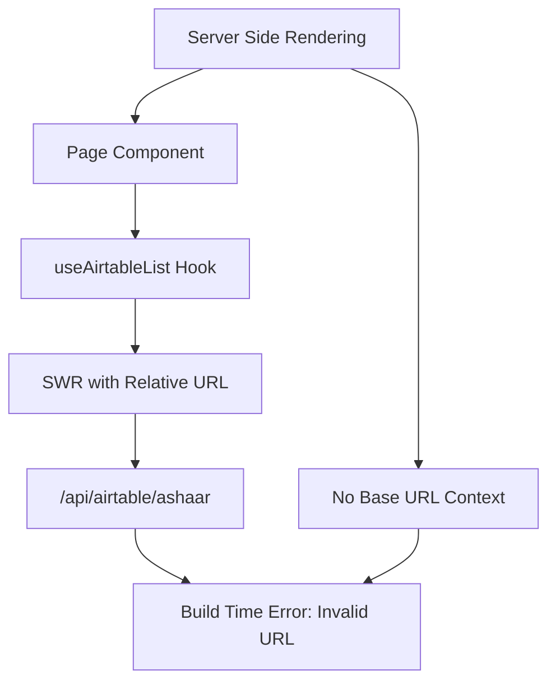
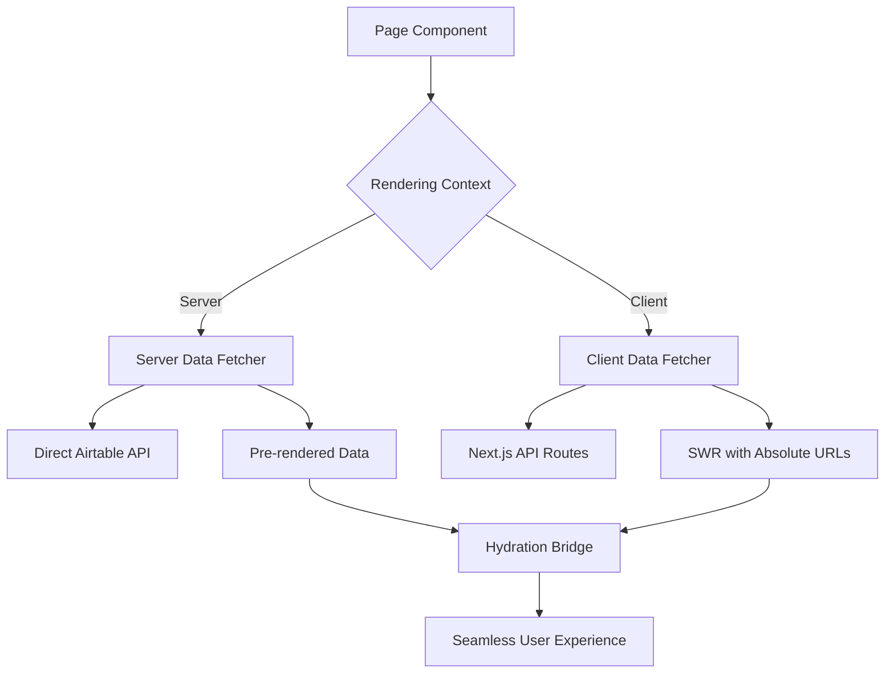

# Design Document

## Overview

The current architecture has a fundamental issue where client-side data fetching hooks (`useAirtableList`, `useSWR`) are being used in components that undergo server-side rendering during the build process. This causes "Failed to parse URL" errors because relative URLs like `/api/airtable/ashaar` cannot be resolved without a proper base URL context during SSR.

The solution involves implementing a dual-mode data fetching architecture that:

1. Uses server-side data fetching for initial page loads and SEO
2. Maintains client-side data fetching for interactive features
3. Provides seamless hydration between server and client states
4. Handles environment-specific URL construction properly

## Architecture

### Current Architecture Issues



### Proposed Architecture



## Components and Interfaces

### 1. Environment-Aware URL Builder

```typescript
interface URLBuilderConfig {
  baseUrl?: string;
  apiPath: string;
  params?: Record<string, any>;
}

interface URLBuilder {
  buildServerURL(config: URLBuilderConfig): string;
  buildClientURL(config: URLBuilderConfig): string;
  getBaseURL(): string;
}
```

**Responsibilities:**

- Detect server vs client environment
- Construct absolute URLs for server-side calls
- Construct relative URLs for client-side calls
- Handle different deployment environments (dev, staging, prod)

### 2. Universal Data Fetcher

```typescript
interface DataFetcherOptions {
  cache?: boolean;
  revalidate?: number;
  fallback?: any;
}

interface UniversalDataFetcher {
  fetchList<T>(params: ListParams, options?: DataFetcherOptions): Promise<T[]>;
  fetchRecord<T>(id: string, options?: DataFetcherOptions): Promise<T>;
  isServer(): boolean;
  isClient(): boolean;
}
```

**Responsibilities:**

- Provide unified interface for both server and client
- Route calls to appropriate fetcher based on environment
- Handle caching strategies per environment
- Manage error handling and fallbacks

### 3. Server-Side Data Fetcher

```typescript
interface ServerDataFetcher {
  fetchAshaarList(params: ListParams): Promise<AshaarRecord[]>;
  fetchGhazlenList(params: ListParams): Promise<GhazlenRecord[]>;
  fetchNazmenList(params: ListParams): Promise<NazmenRecord[]>;
  fetchRubaiList(params: ListParams): Promise<RubaiRecord[]>;
  fetchEbooksList(params: ListParams): Promise<EbookRecord[]>;
}
```

**Responsibilities:**

- Direct Airtable API communication during SSR
- Implement proper error handling for build-time failures
- Cache responses for performance
- Provide fallback data when APIs are unavailable

### 4. Client-Side Data Fetcher

```typescript
interface ClientDataFetcher {
  useAshaarList(params: ListParams): SWRResponse<AshaarRecord[]>;
  useGhazlenList(params: ListParams): SWRResponse<GhazlenRecord[]>;
  useNazmenList(params: ListParams): SWRResponse<NazmenRecord[]>;
  useRubaiList(params: ListParams): SWRResponse<RubaiRecord[]>;
  useEbooksList(params: ListParams): SWRResponse<EbookRecord[]>;
}
```

**Responsibilities:**

- SWR-based data fetching for client interactions
- Optimistic updates and mutations
- Real-time data synchronization
- Client-side caching and revalidation

### 5. Hydration Bridge

```typescript
interface HydrationBridge {
  serializeServerData<T>(data: T): string;
  deserializeServerData<T>(serialized: string): T;
  hydrateClientState<T>(serverData: T, clientHook: any): void;
}
```

**Responsibilities:**

- Serialize server-fetched data for client hydration
- Prevent hydration mismatches
- Initialize client-side SWR cache with server data
- Handle graceful fallbacks during hydration

## Data Models

### Enhanced List Parameters

```typescript
interface EnhancedListParams extends ListParams {
  ssrFallback?: boolean;
  buildTimeSafe?: boolean;
  cacheStrategy?: "server" | "client" | "hybrid";
}
```

### Environment Context

```typescript
interface EnvironmentContext {
  isServer: boolean;
  isClient: boolean;
  isBuild: boolean;
  baseUrl: string;
  apiEndpoint: string;
}
```

### Data Fetching Result

```typescript
interface DataFetchingResult<T> {
  data: T;
  error?: Error;
  isLoading: boolean;
  source: "server" | "client" | "cache";
  revalidate: () => Promise<void>;
}
```

## Error Handling

### Build-Time Error Prevention

1. **Graceful API Failures**: When Airtable API is unavailable during build, use cached data or empty fallbacks
2. **URL Validation**: Validate all URLs before making requests, with clear error messages
3. **Environment Detection**: Robust detection of build vs runtime environments
4. **Timeout Handling**: Implement timeouts for build-time API calls to prevent hanging builds

### Runtime Error Recovery

1. **Stale-While-Revalidate**: Use cached data while fetching fresh data in background
2. **Exponential Backoff**: Retry failed requests with increasing delays
3. **Circuit Breaker**: Temporarily disable failing endpoints to prevent cascading failures
4. **User Feedback**: Provide meaningful error messages to users

## Testing Strategy

### Server-Side Testing

1. **Build Process Tests**: Verify builds complete successfully with various API states
2. **SSR Data Tests**: Ensure server-rendered pages contain expected data
3. **URL Construction Tests**: Validate URL building in different environments
4. **Fallback Tests**: Test behavior when APIs are unavailable

### Client-Side Testing

1. **Hydration Tests**: Verify smooth transition from server to client state
2. **SWR Integration Tests**: Test client-side data fetching and caching
3. **Error Boundary Tests**: Ensure graceful error handling in UI
4. **Performance Tests**: Measure impact on page load times

### Integration Testing

1. **End-to-End SEO Tests**: Verify search engines can crawl and index content
2. **Cross-Environment Tests**: Test behavior across dev, staging, and production
3. **Network Condition Tests**: Test with various network conditions and failures
4. **Cache Consistency Tests**: Ensure data consistency between server and client caches

## Implementation Phases

### Phase 1: Environment-Aware Infrastructure

- Implement URL builder with environment detection
- Create universal data fetcher interface
- Set up proper error handling and logging

### Phase 2: Server-Side Data Fetching

- Implement direct Airtable API calls for SSR
- Add build-time safe fallbacks
- Create data serialization for hydration

### Phase 3: Client-Side Integration

- Update existing hooks to use new infrastructure
- Implement hydration bridge
- Add optimistic updates and mutations

### Phase 4: Performance Optimization

- Implement advanced caching strategies
- Add request deduplication
- Optimize bundle size and loading performance

## Migration Strategy

### Backward Compatibility

- Maintain existing hook interfaces during transition
- Provide feature flags for gradual rollout
- Support both old and new patterns temporarily

### Gradual Migration

1. Start with most critical pages (homepage, popular content)
2. Migrate one content type at a time (Ashaar → Ghazlen → Nazmen → etc.)
3. Monitor performance and SEO metrics during migration
4. Complete migration once all pages are stable

### Rollback Plan

- Keep old implementation available as fallback
- Implement feature toggles for quick rollback
- Monitor error rates and performance metrics
- Have automated rollback triggers for critical failures
